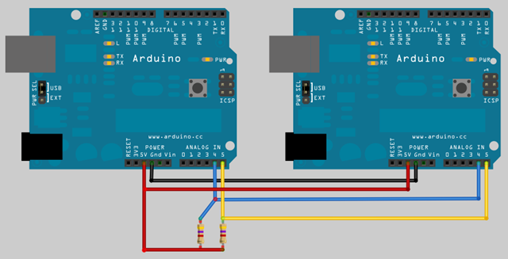
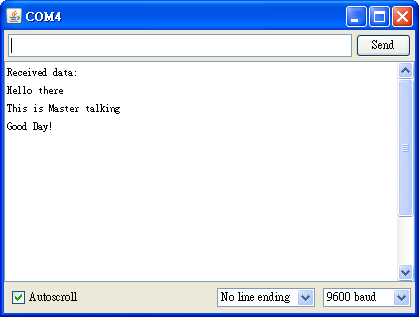

## Arduino入門教學(11) – 多台 Arduino 間的通訊 - 透過 I2C (作者：Cooper Maa)

今天我們要介紹怎麼讓多台 Arduino 互相通訊。我們所用的通訊協定是 I2C Protocol，I2C 只需要兩支腳位就可以讓設備建立通訊，這兩支腳位一個叫作 SDA (Serial DAta line)，另一個叫作 SCL (Serial CLock Line)。在大部份的 Arduino 板子上，SDA 是在 analog pin 4，而 SCL 是在 analog pin 5。

### 接線

參考底下的接線圖連接你的 Arduino:



接線方法很簡單，你只要把每一台 Arduino 的 SDA (analog pin 4), SCL (analog pin 5), GND 和 5V 分別連接在一起就可以了。另外，最好在 SDA 和 SCL 上加個接到 5V 的 4.7K 歐姆提升電阻以確保預設電壓為高電位。

I2C 是 Master-Slave 的架構，Master 可以向 Slave 發出需求要資料或傳送資料。I2C bus 上最多可以有 128 個設備。在 I2C bus 上可以有多個 Master 和多個 Slave，不過為了避免複雜，通常我們只會用一個 Master。每個 Slave 都會有一個識別的號碼，叫作 Slave address，Master 要跟 Slave 通訊的時候，就利用 Slave address 指定要跟哪個 Slave 建立對話。

底下將示範怎麼讓兩台 Arduino 透過 I2C 建立通訊。這兩台 Arduino 一台是 Master，一台是 Slave，其中 Slave 所用的 address 為 1。

### 程式

底下是 Master 的程式:

```CPP
// master_sender.ino
// Refer to the "slave_receiver" example for use with this
#include <Wire.h>

const int SLAVE_ADDRESS = 1;
char incomingByte = 0;

void setup() {  
  Wire.begin();         // join I2C bus as a Master
  
  Serial.begin(9600);
  Serial.println("Type something to send:");
}

void loop() {
}

void serialEvent()
{
  // read one byte from serial port
  incomingByte = Serial.read();

  // send the received data to slave
  Wire.beginTransmission(SLAVE_ADDRESS);
  Wire.write(incomingByte);
  Wire.endTransmission();
}
```

程式說明:

* Master 使用 Wire.begin() 加入 I2C bus
* 當 serial port 上有收到資料時，Arduino 會自動執行 serialEvent()。
* 在 serialEvent() 函式中，Master 首先會從 serial port 讀取一個 byte 的資料，然後再利用底下三行程式將資料透過 I2C 送給 Slave 1。
* 每當 Master 要送資料給 Slave 的時候，要先呼叫 Wire.beginTransmission() 建立傳輸，緊接著呼叫 Wire.write() 把資料放到 buffer，最後呼叫 Wire.endTransmission() 真正送出資料並結束傳輸。

```CPP
// send the received data to slave
Wire.beginTransmission(SLAVE_ADDRESS);
Wire.write(incomingByte);
Wire.endTransmission();
```

底下則是 Slave 的程式:

```CPP
// slave_receiver.ino
// Refer to the "master_sender" example for use with this
#include <Wire.h>

const int SLAVE_ADDRESS = 1;
char incomingByte = 0;

void setup() {  
  Wire.begin(SLAVE_ADDRESS);    // join I2C bus as a slave with address 1
  Wire.onReceive(receiveEvent); // register event
  
  Serial.begin(9600);
  Serial.println("Received data:");
}

void loop() {
}

void receiveEvent(int howMany)
{
  while (Wire.available()) 
  {
    // receive one byte from Master
    incomingByte = Wire.read();
    Serial.print(incomingByte);
  }
}
```

程式說明:

* Slave 一樣是使用 Wire.begin() 加入 I2C bus，但是必須傳入一個參數指定所用的 address
* 利用 Wire.onReceive(receiveEvent) 註冊事件，之後當 Master 送資料給 Slave 時，Arduino 就會自動呼叫 receiveEvent()
* 在 receiveEvent() 中，程式的邏輯很簡單，只是利用 Wire.available() 檢查是否有資料，接著利用 Wire.read() 將資料出來再丟到 serial port 上。

### 執行結果

程式執行的時候，首先你會看到 Master 丟出一行 "Type something to send: " 的訊息。你可以在上面輸入任何資料，例如:


這時候 Slave 端就會顯示從 Master 端收到的資料，如下:



注意，在使用 Tera Term 的時候，記得要先設定 Terminal，這樣才可以看得到你輸入的資料而且 Tera Term 才會正確換行:


▲ 記得到 Setup > Terminal 畫面把 Transmit 改成 CR+LF 並把 Local echo 打開

### 參考資料
* [I2C-Bus Specification](http://www.nxp.com/documents/other/39340011.pdf)
* [Wire Library](http://arduino.cc/en/Reference/Wire)
* [Communication between multiple Arduinos](http://marcoramilli.blogspot.com/2011/10/communication-between-multiple-arduino.html)
* [Arduino 1.0 的 serialEvent 介紹](http://coopermaa2nd.blogspot.com/2011/12/arduino-10-serialevent.html)
* [Tera Term](http://ttssh2.sourceforge.jp/)
* [多台 Arduino 間的通訊 - 透過 I2C #1](http://coopermaa2nd.blogspot.tw/2011/12/arduino-i2c-1.html)
* [多台 Arduino 間的通訊 - 透過 I2C #2](http://coopermaa2nd.blogspot.tw/2011/12/arduino-i2c-2.html)
* [多台 Arduino 間的通訊 - 透過 I2C #3](http://coopermaa2nd.blogspot.tw/2011/12/arduino-i2c-3.html)
* [多台 Arduino 間的通訊 - 透過 I2C #4](http://coopermaa2nd.blogspot.tw/2011/12/arduino-i2c-4.html)
* [EasyTransfer Library for Arduino](http://coopermaa2nd.blogspot.tw/2011/08/easytransfer-library-for-arduino.html)
* [EasyTransfer over I2C bus](http://coopermaa2nd.blogspot.tw/2011/12/easytransfer-over-i2c-bus.html)

【本文作者為馬萬圳，原文網址為： <http://coopermaa2nd.blogspot.tw/2011/12/arduino-i2c.html> ，由陳鍾誠編輯後納入本雜誌】

