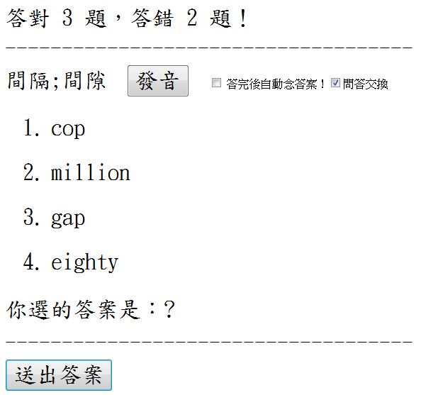

## JavaScript (11) – 英文單字測驗程式 (作者：陳鍾誠)

在前兩期的「程式人雜誌」當中，我們介紹了的語音合成與辨識的主題，讓網頁也能做語音輸入或念出文章的動作，網址如下：

* [JavaScript (9) – Google 的語音合成 API 之使用](https://dl.dropboxusercontent.com/u/101584453/pmag/201309/htm/article2.html)
* [JavaScript (10)– Google 的語音辨識 API 之使用](https://dl.dropboxusercontent.com/u/101584453/pmag/201310/htm/article2.html)

### 簡介

在本期中，我們將利用 Google 的語音合成功能，製作一個簡單的測驗程式，這個程式會隨機的抽取題目出來，然後製作出考題來測驗使用者。

由於運用了 Google 語音功能，可以讓使用者按下發音鈕聽英文發音，因此還沒學會拼字的小學生也可以用這個程式來學習英文。

此系統會自動累計計算您所答對與答錯的題目數量，透過這個程式，您可以測驗某人是否已經熟悉一群單字，這很適合用來考英文單字，我都用這個系統來考自己的小孩，看看他們英文單字是否背熟了。

為了鼓勵我的小孩使用這個程式，如果他們回答十題後，錯誤在一題之內的話，我就讓他們玩五分鐘的電動，我發現這樣學英文
還蠻方便的。

以下是這個「英文單字測驗程式」的介面，每次該程式都會隨機從「測驗題庫」中抽一組題目出來，然後再隨機產生四組答案 (不可與題目的答案重複) 當作候選項，接著用標準答案從剛剛產生的四組答案中隨機取代一組，如此四組答案當中必然有一個正確答案，以下是該程式的一個出題畫面。


當測驗者選取答案並按下送出後，如果答錯了，系統會告訴您正確答案，請您更正。如果答對了，則系統將會讓您進到下一題，同時計算答對與答錯的題數。
以下是一個答錯時系統要求更正的畫面。


如果您在發音按鈕上按一下，則系統會使用 Google 語音合成 API 念出題目上的詞彙，這個功能對剛學英文的小孩特別有用，因為他們還不是很會拼字，
但是聽得懂發音，因此可以根據發音去猜測答案。

如果您在「答完後自動念答案！」這個選項上打勾，那麼當您答完之後，系統將念出整個正確答案。另外、如果您勾選「問答交換」這個選項，那麼
原本的「看英文、答中文」的功能，會切換成「看中文、答英文」的功能，如下所示：



### 使用影片

我已經將這個程式放在自己的 dropbox 網站當中，您可以點選下列網址來「用用看」這個程式，應該會更瞭解整個程式的運作過程。

* <https://dl.dropboxusercontent.com/u/101584453/en/english.html>

或者您可以先看看我自己使用這個程式的一段教學錄影，先瞭解這個程式的操作方法，然後再自行操做看看：

* <http://youtu.be/VtZTfCqCWgQ>

### 程式原始碼

以下是這個程式的完整原始碼，您也可以剪貼後存放在自己電腦中使用，請記得要存成 UTF-8 格式。

檔案：english.html

```html
<html>
<head>
<meta charset="utf-8" />
<style>
label, li, input { font-size:200%; font-family:標楷體; }
li { margin:25px 25px 25px 25px; }
a:hover { color:red; }
</style>
<style id="showboxstyle">
</style>
<script type="text/javascript">

var qaStr= "zero=零, one=一, two=二, three=三, four=四, five=五, six=六, seven=七, eight=八, nine=九, ten=十, eleven=十一, twelve=十二, thirteen=十三, fourteen=十四, fifteen=十五, sixteen=十六, seventeen=十七, eighteen=十八, nineteen=十九, twenty=二十, thirty=三十, forty=四十, fifty=五十, sixty=六十, seventy=七十, eighty=八十, ninety=九十, houndred=百, thousand=千, million=百萬, billion=十億, year=年, I=我, you=你, he=他(男生), she=她(女生), old=老;年齡大, read=讀, trace=描繪;跟著劃, unit=單元, how=如何, tall=高的, short=矮的, content=內容, write=寫, practice=練習, worksheet=工作清單, sentence=句子, learn=學習, new=新的, word=單字;詞彙, daily=每天的, count=數;算, repeat=重複, after=在...之後, sorrt=對不起, bad=壞的, father;dad=爹地;爸爸, bat=球棒, cat=貓, rat=老鼠, mad=生氣;抓狂, fat=胖的, bed=床, chair=椅子, desk=書桌, sofa=沙發, table=桌子, is;are;was;were=是, it=它, my=我的, no=不, on=在...上面, the=這個, under=在..下面, where=在哪裡, bag=袋子, key=鑰匙, pencil=鉛筆, box=盒子, watch=手錶, bottle=水壺, not=不, that=那個, this=這個, yes=是, your=你的, dig=挖, dot=小圓點, tip=小費;頂端, tub=桶子, zip=拉鏈, sip=吸, sit=坐, zoo=動物園, sad=傷心的;難過的, gap=間隔;間隙, cap=鴨舌帽, get=得到, cop=警察, god=上帝;神, cut=切;割, web=蜘蛛網, wet=濕的, hit=打擊, wit=機智, hop=單腳跳";

var qa = qaStr.split(",");

function rand(n) {
  return Math.floor(Math.random()*n)
}

function selectQA() {
  return qa[rand(qa.length)];
}

function Q(s) { 
  if (isSwap.checked) 
    return s.split("=")[1]; 
  else
    return s.split("=")[0]; 
}

function A(s) { 
  if (isSwap.checked) 
    return s.split("=")[0]; 
  else
    return s.split("=")[1]; 
}

var question=null, answers=[], choice=null, q=null, msg=null;
var audioControlQ = null, audioControlA = null, audioErrorControl=null, audioCorrectControl=null;
var correct=0, wrong=0, isChecked = false;

function load() {
  question = document.getElementById("question");
  answers = [];
  answers[1]  = document.getElementById("answer1");
  answers[2]  = document.getElementById("answer2");
  answers[3]  = document.getElementById("answer3");
  answers[4]  = document.getElementById("answer4");
  choice = document.getElementById("choice");
  msg = document.getElementById("msg");
  countMag = document.getElementById("countMsg");
  isAudio = document.getElementById("isAudio");
  isSwap = document.getElementById("isSwap");
  audioControlQ = document.getElementById("audio");
  audioControlQ.addEventListener('ended', function(){ this.currentTime = 0; }, false);
  audioControlA = document.getElementById("audio_zh");
  audioControlA.addEventListener('ended', function(){ this.currentTime = 0; }, false);
  audioErrorControl = document.getElementById("audio_error");
  audioErrorControl.addEventListener('ended', function(){ this.currentTime = 0; }, false);
  audioCorrectControl = document.getElementById("audio_error");
  audioCorrectControl.addEventListener('ended', function(){ this.currentTime = 0; }, false);
}

function chooseA(obj) {
  choice.innerHTML = obj.innerHTML;
}

function test() {
  isChecked = false;
  choice.innerHTML = "?";
  msg.innerHTML = "";
  q = selectQA();
  question.innerHTML = Q(q);
  answer = A(q);
  if (isSwap.checked) {
    audioControlQ.src = 'http://translate.google.com/translate_tts?ie=utf-8&tl=zh&q='+Q(q);
    audioControlA.src = 'http://translate.google.com/translate_tts?ie=utf-8&tl=en&q='+A(q);
  }
  else {
    audioControlQ.src = 'http://translate.google.com/translate_tts?ie=utf-8&tl=en&q='+Q(q);
    audioControlA.src = 'http://translate.google.com/translate_tts?ie=utf-8&tl=zh&q='+A(q);
  }
  var set = {};
  set[q] = "";
  for (i=1; i<=4; ) {
    a = selectQA();
    answers[i].innerHTML = A(a);
	if (set[a] == "") continue; else i++;
	set[a] = "";
  }
  answers[1+rand(4)].innerHTML = A(q);
}

function check() {
  if (isAudio.checked) {
    if (choice.innerHTML != A(q)) {
      setTimeout(function () {
        playAudio('audio_error');
	  }, 1000);
    } else {
      setTimeout(function () {
        playAudio('audio_correct');
	  }, 1000);
    }
    setTimeout(function () {
      playAudio('audio');
    }, 3000);
    setTimeout(function () {
      playAudio('audio_zh');
    }, 4000);
  }
  if (isChecked) return (choice.innerHTML == A(q));
  isChecked = true;
  if (choice.innerHTML == A(q)) {
    msg.innerHTML = "答對了！"+Q(q)+"="+A(q);
	correct ++;
  } else {
    msg.innerHTML = "答錯了！"+Q(q)+"="+A(q)+"，請更正！";
	wrong ++;
  }
  countMsg.innerHTML = "答對 "+correct+" 題，答錯 "+wrong+" 題！";
  return (choice.innerHTML == A(q));
}

function pass() {
  if (check()) {
   if (isAudio.checked)
     passDelay = 6000;
   else 
     passDelay = 0;
    setTimeout(function () {
      test();
	}, passDelay);
  }
}

function playAudio(name) {
  document.getElementById(name).play();
}

</script>	
</head>
<body onload="load(); test()">
<form>
<table width="95%">
<tr><td><label id="countMsg">答對 0 題，答錯 0 題！</label></tr>
<tr><td><label>------------------------------------</label></tr>
<tr><td>
  <label id="question">詞彙</label> &nbsp; &nbsp; &nbsp; 
  <audio id="audio_correct" src="http://translate.google.com/translate_tts?ie=utf-8&tl=zh&q=答對了"></audio>
  <audio id="audio_error" src="http://translate.google.com/translate_tts?ie=utf-8&tl=zh&q=答錯了"></audio>
  <audio id="audio" src="http://translate.google.com/translate_tts?ie=utf-8&tl=en&q=mother"></audio>
  <audio id="audio_zh" src="http://translate.google.com/translate_tts?ie=utf-8&tl=zh&q=媽媽"></audio>
  <input type="button" onclick="playAudio('audio')" value="發音">  
  &nbsp; &nbsp; &nbsp; <input type="checkbox" id="isAudio"> 答完後自動念答案！<input type="checkbox" id="isSwap" onchange="test()">問答交換
  <ol>
	<li><a id="answer1" onclick="chooseA(this)">答案1</a></li>
	<li><a id="answer2" onclick="chooseA(this)">答案2</a></li>
	<li><a id="answer3" onclick="chooseA(this)">答案3</a></li>
	<li><a id="answer4" onclick="chooseA(this)">答案4</a></li>
  </ol>
</td></tr>
<tr><td><label>你選的答案是：</label><label id="choice">?</label></td></tr>
<tr><td><label id="msg">正確的答案是：?</label></td></tr>
<tr><td><label>------------------------------------</label></tr>
<tr><td>
<input type="button" value="送出答案" onclick="pass()"/><br/>
</td></tr>
</table>
</form>
</body>
</html>
```

### 結語

透過 Google 語音 API，我們可以很容易的將發音功能或語音辨識功能加入到網頁中，這樣的功能對於像上述的測驗系統來說特別有用，這樣的網路服務大大的提升了網頁 JavaScript 程式設計人員的開發速度，讓建構這類的網站更加容易了。

從今年一月開始，本系列關於 JavaScript 的文章到此已經刊載了 11  期，到此將暫時告一個段落，日後筆者若還有關於 JavaScript 的文章，也還會不定期與讀者分享，感謝大家的閱讀！

### 參考文獻
* [JavaScript (9) – Google 的語音合成 API 之使用](https://dl.dropboxusercontent.com/u/101584453/pmag/201309/htm/article2.html)
* [JavaScript (10)– Google 的語音辨識 API 之使用](https://dl.dropboxusercontent.com/u/101584453/pmag/201310/htm/article2.html)
