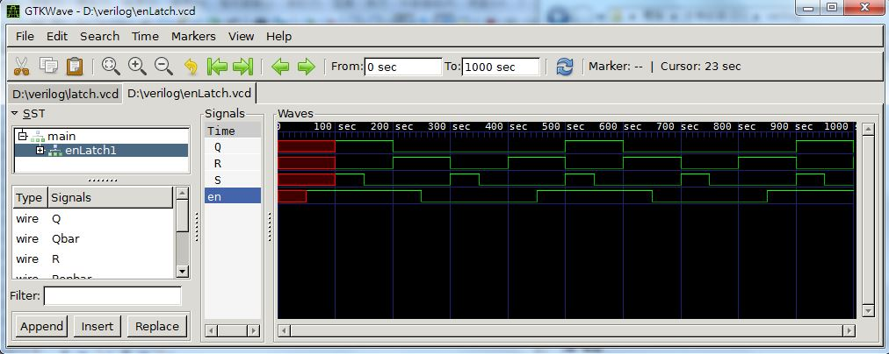

## Verilog (5) – 邊緣觸發正反器 (作者：陳鍾誠)

在本文中，我們將介紹如何用 Verilog 實作兩種概念，第一個是正反器 (Latch, Flip-Flop)，第二個是脈波變化偵測器 (Pulse Transition Detector)，然後再用這兩個元件組合成「邊緣觸發正反器」 (Edge Triggered Flip-Flop)。

### 正反器

正反器是可以用來儲存位元，是循序電路的基礎，以下是一個用 NAND 閘構成的正反器。


我們可以根據上圖實作出對應的 Verilog 程式如下：

檔案：latch.v

```verilog
module latch(input Sbar, Rbar, output Q, Qbar);
  nand LS(Q, Sbar, Qbar);
  nand LR(Qbar, Rbar, Q);
endmodule

module main;
reg Sbar, Rbar;
wire Q, Qbar;

latch latch1(Sbar, Rbar, Q, Qbar);

initial
begin
  $monitor("%4dns monitor: Sbar=%d Rbar=%d Q=%d Qbar=%d", $stime, Sbar, Rbar, Q, Qbar);
  $dumpfile("latch.vcd"); // 輸出給 GTK wave 顯示波型
  $dumpvars;    
end

always #50 begin
  Sbar = 0; Rbar = 1;
  #50;
  Sbar = 1; Rbar = 1;
  #50;
  Sbar = 1; Rbar = 0;
  #50;
end

initial #500 $finish;

endmodule
```

執行結果：

```
D:\verilog>iverilog -o latch latch.v

D:\verilog>vvp latch
VCD info: dumpfile latch.vcd opened for output.
   0ns monitor: Sbar=x Rbar=x Q=x Qbar=x
  50ns monitor: Sbar=0 Rbar=1 Q=1 Qbar=0
 100ns monitor: Sbar=1 Rbar=1 Q=1 Qbar=0
 150ns monitor: Sbar=1 Rbar=0 Q=0 Qbar=1
 250ns monitor: Sbar=0 Rbar=1 Q=1 Qbar=0
 300ns monitor: Sbar=1 Rbar=1 Q=1 Qbar=0
 350ns monitor: Sbar=1 Rbar=0 Q=0 Qbar=1
 450ns monitor: Sbar=0 Rbar=1 Q=1 Qbar=0
 500ns monitor: Sbar=1 Rbar=1 Q=1 Qbar=0
```


### 有 enable 的正反器

如果我們在上述正反器前面再加上兩個 NAND 閘進行控制，就可以形成一組有 enable 的正反器，以下是該正反器的圖形。


根據上述圖形我們可以設計出以下的 Verilog 程式。

檔案：enLatch.v

```verilog
module latch(input Sbar, Rbar, output Q, Qbar);
  nand LS(Q, Sbar, Qbar);
  nand LR(Qbar, Rbar, Q);
endmodule

module enLatch(input en, S, R, output Q, Qbar);
  nand ES(Senbar, en, S);
  nand ER(Renbar, en, R);
  latch L1(Senbar, Renbar, Q, Qbar);
endmodule

module main;
reg S, en, R;
wire Q, Qbar;

enLatch enLatch1(en, S, R, Q, Qbar);

initial
begin
  $monitor("%4dns monitor: en=%d S=%d R=%d Q=%d Qbar=%d", $stime, en, S, R, Q, Qbar);
  $dumpfile("enLatch.vcd"); // 輸出給 GTK wave 顯示波型
  $dumpvars;    
end

always #50 begin
  en = 1;
  #50;
  S = 1; R = 0;
  #50;
  S = 0; R = 0;
  #50;
  S = 0; R = 1;
  #50
  en = 0;
  #50;
  S = 1; R = 0;
  #50;
  S = 0; R = 0;
  #50;
  S = 0; R = 1;
end

initial #1000 $finish;

endmodule
```

執行結果

```
D:\verilog>iverilog -o enLatch enLatch.v

D:\verilog>vvp enLatch
VCD info: dumpfile enLatch.vcd opened for output.
   0ns monitor: en=x Sbar=x Rbar=x Q=x Qbar=x
  50ns monitor: en=1 Sbar=x Rbar=x Q=x Qbar=x
 100ns monitor: en=1 Sbar=1 Rbar=0 Q=1 Qbar=0
 150ns monitor: en=1 Sbar=0 Rbar=0 Q=1 Qbar=0
 200ns monitor: en=1 Sbar=0 Rbar=1 Q=0 Qbar=1
 250ns monitor: en=0 Sbar=0 Rbar=1 Q=0 Qbar=1
 300ns monitor: en=0 Sbar=1 Rbar=0 Q=0 Qbar=1
 350ns monitor: en=0 Sbar=0 Rbar=0 Q=0 Qbar=1
 400ns monitor: en=0 Sbar=0 Rbar=1 Q=0 Qbar=1
 450ns monitor: en=1 Sbar=0 Rbar=1 Q=0 Qbar=1
 500ns monitor: en=1 Sbar=1 Rbar=0 Q=1 Qbar=0
 550ns monitor: en=1 Sbar=0 Rbar=0 Q=1 Qbar=0
 600ns monitor: en=1 Sbar=0 Rbar=1 Q=0 Qbar=1
 650ns monitor: en=0 Sbar=0 Rbar=1 Q=0 Qbar=1
 700ns monitor: en=0 Sbar=1 Rbar=0 Q=0 Qbar=1
 750ns monitor: en=0 Sbar=0 Rbar=0 Q=0 Qbar=1
 800ns monitor: en=0 Sbar=0 Rbar=1 Q=0 Qbar=1
 850ns monitor: en=1 Sbar=0 Rbar=1 Q=0 Qbar=1
 900ns monitor: en=1 Sbar=1 Rbar=0 Q=1 Qbar=0
 950ns monitor: en=1 Sbar=0 Rbar=0 Q=1 Qbar=0
1000ns monitor: en=1 Sbar=0 Rbar=1 Q=0 Qbar=1
```



### 脈波變化偵測器 (Pulse Transition Detector, PTD)

傳統上，要做邊緣觸發的正反器，必須使用 Master-Slave 的架構，這樣要消耗較多的邏輯閘，但是現在通常改用 「脈波變化偵測電路」來偵測時脈的邊緣，這樣不僅可以簡化電路，而且適用性也更廣、更好用，因為任何需要偵測邊緣的地方都可以使用這樣的電路進行偵測。

以下是「脈波變化偵測電路」的圖形，其中的關鍵是在 左邊的 not 閘身上，由於每個閘都會造成延遲，因此多了 not 閘的那條路徑所造成的延遲較多，這讓輸出部份會因為延遲而形成一個脈衝波形。


以下是這個電路以 Verilog 實作的結果。

檔案：ptd.v

```verilog
module ptd(input clk, output ppulse);
  not #2 P1(nclkd, clk);
  nand #2 P2(npulse, nclkd, clk);
  not #2 P3(ppulse, npulse);
endmodule

module main;
 reg clk;
 wire p;

 ptd ptd1(clk, p);

 initial begin
   clk = 0;
   $monitor("%dns monitor: clk=%b p=%d", $stime, clk, p);
   $dumpfile("ptd.vcd"); // 輸出給 GTK wave 顯示波型
   $dumpvars;
 end

 always #50 begin
   clk = clk + 1;
 end

initial #500 $finish;

endmodule
```

執行結果

```
D:\Dropbox\Public\pmag\201311\code>iverilog -o ptd ptd.v

D:\Dropbox\Public\pmag\201311\code>vvp ptd
VCD info: dumpfile ptd.vcd opened for output.
         0ns monitor: clk=0 p=z
         4ns monitor: clk=0 p=0
        50ns monitor: clk=1 p=0
        54ns monitor: clk=1 p=1
        56ns monitor: clk=1 p=0
       100ns monitor: clk=0 p=0
       150ns monitor: clk=1 p=0
       154ns monitor: clk=1 p=1
       156ns monitor: clk=1 p=0
       200ns monitor: clk=0 p=0
       250ns monitor: clk=1 p=0
       254ns monitor: clk=1 p=1
       256ns monitor: clk=1 p=0
       300ns monitor: clk=0 p=0
       350ns monitor: clk=1 p=0
       354ns monitor: clk=1 p=1
       356ns monitor: clk=1 p=0
       400ns monitor: clk=0 p=0
       450ns monitor: clk=1 p=0
       454ns monitor: clk=1 p=1
       456ns monitor: clk=1 p=0
       500ns monitor: clk=0 p=0
```


### 邊緣觸發的正反器

有了「正反器」與「脈波變化偵測電路」之後，我們就可以組合出「邊緣觸發正反器」了，以下是其電路圖。


事實上，上述電路圖只是將「有 enable 的正反器」前面加上一個「脈波變化偵測電路」而已，其實做的 Verilog 程式如下。

檔案：ptdLatch.v

```verilog
module latch(input Sbar, Rbar, output Q, Qbar);
  nand LS(Q, Sbar, Qbar);
  nand LR(Qbar, Rbar, Q);
endmodule

module enLatch(input en, S, R, output Q, Qbar);
  nand ES(Senbar, en, S);
  nand ER(Renbar, en, R);
  latch L1(Senbar, Renbar, Q, Qbar);
endmodule

module ptd(input clk, output ppulse);
  not  #2 P1(nclkd, clk);
  nand #2 P2(npulse, nclkd, clk);
  not  #2 P3(ppulse, npulse);
endmodule

module ptdLatch(input clk, S, R, output Q, Qbar);
  ptd PTD(clk, ppulse);
  enLatch EL(ppulse, S, R, Q, Qbar);
endmodule

module main;
reg S, clk, R;
wire Q, Qbar;

ptdLatch ptdLatch1(clk, S, R, Q, Qbar);

initial
begin
  clk = 0;
  $monitor("%4dns monitor: clk=%d ppulse=%d S=%d R=%d Q=%d Qbar=%d", $stime, clk, ptdLatch1.ppulse, S, R, Q, Qbar);
  $dumpfile("ptdLatch.vcd"); // 輸出給 GTK wave 顯示波型
  $dumpvars;    
end

always #20 begin
  clk = ~clk;
end

always #50 begin
  S = 1; R = 0;
  #50;
  S = 0; R = 0;
  #50;
  S = 0; R = 1;
  #50;
end

initial #500 $finish;

endmodule
```

執行結果

```
D:\verilog>iverilog -o ptdLatch ptdLatch.v

D:\verilog>vvp ptdLatch
VCD info: dumpfile ptdLatch.vcd opened for output.
   0ns monitor: clk=0 ppulse=z S=x R=x Q=x Qbar=x
   4ns monitor: clk=0 ppulse=0 S=x R=x Q=x Qbar=x
  20ns monitor: clk=1 ppulse=0 S=x R=x Q=x Qbar=x
  24ns monitor: clk=1 ppulse=1 S=x R=x Q=x Qbar=x
  26ns monitor: clk=1 ppulse=0 S=x R=x Q=x Qbar=x
  40ns monitor: clk=0 ppulse=0 S=x R=x Q=x Qbar=x
  50ns monitor: clk=0 ppulse=0 S=1 R=0 Q=x Qbar=x
  60ns monitor: clk=1 ppulse=0 S=1 R=0 Q=x Qbar=x
  64ns monitor: clk=1 ppulse=1 S=1 R=0 Q=1 Qbar=0
  66ns monitor: clk=1 ppulse=0 S=1 R=0 Q=1 Qbar=0
  80ns monitor: clk=0 ppulse=0 S=1 R=0 Q=1 Qbar=0
 100ns monitor: clk=1 ppulse=0 S=0 R=0 Q=1 Qbar=0
 104ns monitor: clk=1 ppulse=1 S=0 R=0 Q=1 Qbar=0
 106ns monitor: clk=1 ppulse=0 S=0 R=0 Q=1 Qbar=0
 120ns monitor: clk=0 ppulse=0 S=0 R=0 Q=1 Qbar=0
 140ns monitor: clk=1 ppulse=0 S=0 R=0 Q=1 Qbar=0
 144ns monitor: clk=1 ppulse=1 S=0 R=0 Q=1 Qbar=0
 146ns monitor: clk=1 ppulse=0 S=0 R=0 Q=1 Qbar=0
 150ns monitor: clk=1 ppulse=0 S=0 R=1 Q=1 Qbar=0
 160ns monitor: clk=0 ppulse=0 S=0 R=1 Q=1 Qbar=0
 180ns monitor: clk=1 ppulse=0 S=0 R=1 Q=1 Qbar=0
 184ns monitor: clk=1 ppulse=1 S=0 R=1 Q=0 Qbar=1
 186ns monitor: clk=1 ppulse=0 S=0 R=1 Q=0 Qbar=1
 200ns monitor: clk=0 ppulse=0 S=0 R=1 Q=0 Qbar=1
 220ns monitor: clk=1 ppulse=0 S=0 R=1 Q=0 Qbar=1
 224ns monitor: clk=1 ppulse=1 S=0 R=1 Q=0 Qbar=1
 226ns monitor: clk=1 ppulse=0 S=0 R=1 Q=0 Qbar=1
 240ns monitor: clk=0 ppulse=0 S=0 R=1 Q=0 Qbar=1
 250ns monitor: clk=0 ppulse=0 S=1 R=0 Q=0 Qbar=1
 260ns monitor: clk=1 ppulse=0 S=1 R=0 Q=0 Qbar=1
 264ns monitor: clk=1 ppulse=1 S=1 R=0 Q=1 Qbar=0
 266ns monitor: clk=1 ppulse=0 S=1 R=0 Q=1 Qbar=0
 280ns monitor: clk=0 ppulse=0 S=1 R=0 Q=1 Qbar=0
 300ns monitor: clk=1 ppulse=0 S=0 R=0 Q=1 Qbar=0
 304ns monitor: clk=1 ppulse=1 S=0 R=0 Q=1 Qbar=0
 306ns monitor: clk=1 ppulse=0 S=0 R=0 Q=1 Qbar=0
 320ns monitor: clk=0 ppulse=0 S=0 R=0 Q=1 Qbar=0
 340ns monitor: clk=1 ppulse=0 S=0 R=0 Q=1 Qbar=0
 344ns monitor: clk=1 ppulse=1 S=0 R=0 Q=1 Qbar=0
 346ns monitor: clk=1 ppulse=0 S=0 R=0 Q=1 Qbar=0
 350ns monitor: clk=1 ppulse=0 S=0 R=1 Q=1 Qbar=0
 360ns monitor: clk=0 ppulse=0 S=0 R=1 Q=1 Qbar=0
 380ns monitor: clk=1 ppulse=0 S=0 R=1 Q=1 Qbar=0
 384ns monitor: clk=1 ppulse=1 S=0 R=1 Q=0 Qbar=1
 386ns monitor: clk=1 ppulse=0 S=0 R=1 Q=0 Qbar=1
 400ns monitor: clk=0 ppulse=0 S=0 R=1 Q=0 Qbar=1
 420ns monitor: clk=1 ppulse=0 S=0 R=1 Q=0 Qbar=1
 424ns monitor: clk=1 ppulse=1 S=0 R=1 Q=0 Qbar=1
 426ns monitor: clk=1 ppulse=0 S=0 R=1 Q=0 Qbar=1
 440ns monitor: clk=0 ppulse=0 S=0 R=1 Q=0 Qbar=1
 450ns monitor: clk=0 ppulse=0 S=1 R=0 Q=0 Qbar=1
 460ns monitor: clk=1 ppulse=0 S=1 R=0 Q=0 Qbar=1
 464ns monitor: clk=1 ppulse=1 S=1 R=0 Q=1 Qbar=0
 466ns monitor: clk=1 ppulse=0 S=1 R=0 Q=1 Qbar=0
 480ns monitor: clk=0 ppulse=0 S=1 R=0 Q=1 Qbar=0
 500ns monitor: clk=1 ppulse=0 S=0 R=0 Q=1 Qbar=0
```


### 結語

有了「脈波變化偵測電路」，只要與任何需要偵測脈波變化的元件串接起來，就可以達到「邊緣觸發」的功能。

其實、像是 Verilog 當中的以下程式，其實都是利用類似的「脈波變化偵測電路」所完成的。

```verilog
  always @(posedge clock) begin
  ...
  end
```

### 參考文獻
* [陳鍾誠的網站：脈衝偵測電路](http://ccckmit.wikidot.com/ve:ptd)

【本文圖片修改自 [維基百科]，採用創作共用的 [姓名標示、相同方式分享] 授權】
