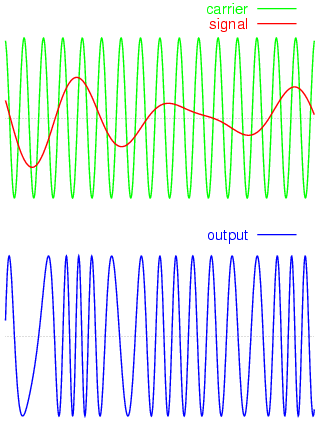
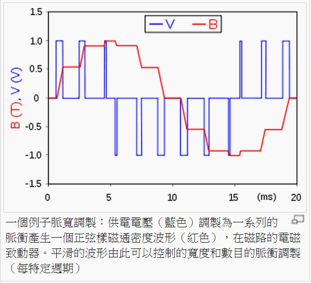

## 討論：如何用 Raspberry Pi 插一根電線就能發送 FM 訊號

網友 Albert Huang 分享了一個很有趣的網頁，說到可以用一個稱為 PiFm 的程式，讓 Raspberry Pi 將 wav 的聲音檔
透過在 GPIO 4 上插一根導線，就可以發送出該聲音的 FM 電磁波訊號。

* [Raspberry Pi Hacks - Turn your Raspberry Pi into a FM Transmitter – Hack Radio Frequencies](http://raspberrypi-hacks.com/7/turn-your-raspberry-pi-into-a-fm-transmitter-hack-radio-frequencies/)

Albert Huang 的說明如下：

> 用 Raspberry GPIO 4 的 Alt1 功能（GPCLK0）來傳送 FM 訊號，利用了因為頻寬限制， GPCLK0 超過 75MHz 之後，就會由方波而愈來愈接近正弦波的原理，而 FM 就是依據輸入的聲音大小來改變 FM 的載波頻率。

以下是在程式人雜誌社團中的原始討論：

* <https://www.facebook.com/groups/programmerMagazine/permalink/733752839974768/>

為了更清楚瞭解到底這是如何運作的，我找到了以下兩個影片，應該可以很清楚的看到運作的過程。

* [YouTube:Turning the Raspberry Pi into an FM transmitter with PiFM](http://youtu.be/blvaYR6aYXA)
* [YouTube:Raspberry Pi as FM Transmitter](http://youtu.be/ekcdAX53-S8)

看完這兩個影片之後，我真的很想知道他是怎麼做的，所以我找到該模組的用法與原始程式下載點：

* 用法： [Turning the Raspberry Pi Into an FM Transmitter](http://www.icrobotics.co.uk/wiki/index.php/Turning_the_Raspberry_Pi_Into_an_FM_Transmitter)

* 程式碼下載點： <http://www.icrobotics.co.uk/wiki/images/c/c3/Pifm.tar.gz>

使用方法如下：

```
sudo python
>>> import PiFm
>>> PiFm.play_sound("sound.wav")
```

PiFm 模組的程式總共包含兩個部份，分別是 Python (PyFm.py) 與 C (PyFm.c) 的程式，但我想主要的重點是 C 的程式，以下是我認為關鍵的部份。

```CPP
void playWav(char* filename, float samplerate)
{
    int fp= STDIN_FILENO;
    if(filename[0]!='-') fp = open(filename, 'r');
    //int sz = lseek(fp, 0L, SEEK_END);
    //lseek(fp, 0L, SEEK_SET);
    //short* data = (short*)malloc(sz);
    //read(fp, data, sz);
    
    int bufPtr=0;
    float datanew, dataold = 0;
    short data;
    
    for (int i=0; i<22; i++) // 掠過 wav 檔的表頭
       read(fp, &data, 2);  // read past header
    
    while (read(fp, &data, 2)) {
	    // fmconstant = 22500 * 50e-6 =  1.125
        float fmconstant = samplerate * 50.0e-6;  // for pre-emphisis filter.  50us time constant
		// wav 取樣頻率一般有11025Hz(11kHz) ，22050Hz(22kHz) 和44100Hz(44kHz)三種，此檔案用 22050Hz
        int clocksPerSample = 22500.0/samplerate*1400.0;  // for timing 
		// 主程式中有 playWav(argv[1], argc>3?atof(argv[3]):22500);
		// 所以 22500.0/samplerate = 1, 於是 clocksPerSample =1400，也就是最小震盪週期會被取 1400 次樣本。
        
        datanew = (float)(data)/32767; // 將資料 data 轉為浮點數
        
        float sample = datanew + (dataold-datanew) / (1-fmconstant);  // fir of 1 + s tau
        float dval = sample*15.0;  // actual transmitted sample.  15 is bandwidth (about 75 kHz)
        
        int intval = (int)(round(dval));  // integer component
        float frac = (dval - (float)intval)/2 + 0.5;
        unsigned int fracval = frac*clocksPerSample;
         
        bufPtr++; 
		// 用直接記憶體映射 DMA 的方法，將資料往 GPIO4 的 allof7e 輸出
		// 參考： 树莓派处理器BCM2835的DMA -- http://www.lijingquan.net/dma-bcm2835-rpi.html
        while( ACCESS(DMABASE + 0x04 /* CurBlock*/) ==  (int)(instrs[bufPtr].p)) usleep(1000);

        ((struct CB*)(instrs[bufPtr].v))->SOURCE_AD = (int)constPage.p + 2048 + intval*4 - 4 ;
        
        bufPtr++;
        while( ACCESS(DMABASE + 0x04 /* CurBlock*/) ==  (int)(instrs[bufPtr].p)) usleep(1000);
        ((struct CB*)(instrs[bufPtr].v))->TXFR_LEN = clocksPerSample-fracval;
        
        bufPtr++;
        while( ACCESS(DMABASE + 0x04 /* CurBlock*/) ==  (int)(instrs[bufPtr].p)) usleep(1000);
        ((struct CB*)(instrs[bufPtr].v))->SOURCE_AD = (int)constPage.p + 2048 + intval*4+4;
        
        bufPtr=(bufPtr+1) % (1024);
        while( ACCESS(DMABASE + 0x04 /* CurBlock*/) ==  (int)(instrs[bufPtr].p)) usleep(1000);
        ((struct CB*)(instrs[bufPtr].v))->TXFR_LEN = fracval;
        
        dataold = datanew;
    }
    close(fp);
}

```

然後我找到維基百科的調頻原理，理面有解說如何將訊號用調頻的方式調變的概念，連結如下：

* [維基百科：頻率調變](http://zh.wikipedia.org/wiki/%E9%A2%91%E7%8E%87%E8%B0%83%E5%88%B6)




但是，要如何用 Raspberry Pi 去送出經過調頻的方式調變的訊號呢？經過我研究與查詢後，我發現 PiFm 好像是利用
GPIO4 裏面的「脈衝寬度調變」(Pulse Width Modulation, PWM) 功能 （Alt1 , GPCLK0），來輸出 FM 調變過後的訊號。

例如下列的 raspberry-gpio-python 專案就有之援類似的功能。

* raspberry-gpio-python -- <https://code.google.com/p/raspberry-gpio-python/wiki/PWM>

因此、我們必須瞭解一下何謂 PWM，以下維基百科的解釋與圖片說明了這項功能的原理。



> 與類比電路不同，數字電路是在預先確定的範圍內取值，在任何時刻，其輸出只可能為ON和OFF兩種狀態，所以電壓或電流會通/斷方式的重複脈衝序列載入到類比負載。PWM技術是一種對類比信號電平的數字編碼方法，通過使用高解析度計數器（調製頻率）調製方波的占空比，從而實現對一個類比信號的電平進行編碼。
> 
> 類比信號能否使用PWM進行編碼調製，僅依賴頻寬，這即意味著只要有足夠的頻寬，任何類比信號值均可以採用PWM技術進行調製編碼，一般而言，負載需要的調製頻率要高於10Hz，在實際應用中，頻率約在1kHz到200kHz之間。

程式可以透過對 PWM port 輸出 (Frequency, Duty cycle) 兩個參數的方式，控制訊號的 PWM 調變，以下文章與影片有較詳細的說明。

* [Raspberry pi has PWM pins](http://developmentboards.blogspot.tw/2013/04/rpigpio-052a-now-has-software-pwm-how.html), Posted by praveen kumar at 07:05
* [YouTube:Using PWM with RPi.GPIO and Python on the Raspberry Pi](http://youtu.be/BLtV0Z38S94)

我猜測 PiFm 就是利用這個功能，對 GPCLK0 輸出不同的方波 (上圖中藍色 V 的部份)，這些方波會控制 PWM 讓它輸出紅色的波形，這些紅色的波形會近似 wav 檔內所代表的波形，於是就能將 wav 檔的聲音以 FM 的方式傳送出去了。

透過上述方式，我們可以用 Raspberry Pi 裏 「CPU+程式」的方式，輸出訊息給 PWM port ，以便將 wav 檔中的訊號，用 FM 的方式調變後輸出，於是「程式人」也可以學如何用 Raspberry Pi 發送「電磁波」，不需要靠額外的板子或 IC 了。

這種做法真棒！

### 參考文獻
* [树莓派处理器BCM2835的DMA](http://www.lijingquan.net/dma-bcm2835-rpi.html)
* [維基百科：頻率調變](http://zh.wikipedia.org/wiki/%E9%A2%91%E7%8E%87%E8%B0%83%E5%88%B6) , (FM)
* [維基百科：脈衝寬度調變](http://zh.wikipedia.org/wiki/%E8%84%88%E8%A1%9D%E5%AF%AC%E5%BA%A6%E8%AA%BF%E8%AE%8A)
* [RPIO.PWM, PWM via DMA for the Raspberry Pi](http://pythonhosted.org/RPIO/pwm_py.html)
* [Raspberry pi has PWM pins](http://developmentboards.blogspot.tw/2013/04/rpigpio-052a-now-has-software-pwm-how.html)
* [PiHAT - Rasberry Pi Home Automation Transmitter](http://www.skagmo.com/page.php?p=projects/22_pihat)
* [Using a Raspberry Pi as an AirPlay Receiver](http://mac.tutsplus.com/tutorials/electronics/using-a-raspberry-pi-as-an-airplay-receiver/)

