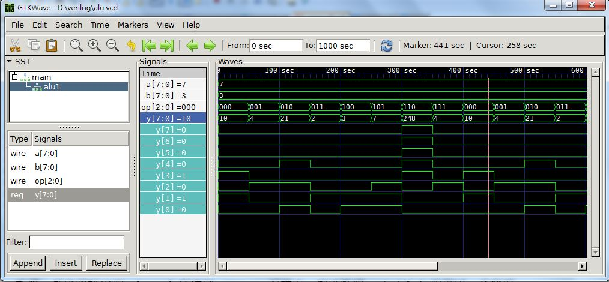

## 軟體短訊：開源波型顯示軟體 - GTKWave

GTKWave 是採用 GTK+ 函式庫設計出來的一個開放原始碼的波形顯示工具，可以讀取 FST, LXT, LXT2, VZT, GHW, VCD/EVCD 等
檔案格式，並且進行波形的互動式顯示，其原始開發平台是 Linux，但也有被移植到 Windows, Mac OS X 等作業系統上。

GTKWave 被 GNU 收錄在開放原始碼的 gEDA 工具平台中，也被開放原始碼的 Verilog 模擬工具 Icarus 納入後用來顯示輸出
的 VCD 格式波形檔。

GTKWave 除了顯示波形以外，也可以將整組 n 條線顯示為「整數、實數、ASCII 字元、二進位、八進位、十進位、十六進位」等等，
因此很適合用來做為 Verilog/VHDL 等模擬軟體的顯示工具。

以下是 GTKWave 的官方下載網址

* <http://gtkwave.sourceforge.net/>

如果您想安裝 Windows 版本的話，可以從以下網址下載：

* <http://www.dspia.com/gtkwave.html>

如果您有安裝 icarus for windows 的話，那麼裡面預設就有安裝 GTKWave，以下是 icarus for windows 的網址：

* <http://bleyer.org/icarus/>

通常 icarus for windows 會將 GTKwave 放在 `C:\iverilog\bin\gtkwave.exe` 這個路徑下，您可以自行點選使用。

以下文件說明了如何讓 icarus 輸出波形的 VCD 格式檔，以及如何用 GTKWave 顯示這些波形的方法。

* [Getting started with Icarus Verilog on Windows]

其中的關鍵是要使用 `$dumpfile("dff.vcd");` 與 `$dumpvars;` 等兩個指令，去輸出波形到 dff.vcd 檔案中。

```verilog
        $dumpfile("dff.vcd");
        $dumpvars;
```

當您用 iverilog -o dff dff.v 指令編譯完程式並用 vvp dff 進行模擬後，就會輸出 dff.vcd 這個檔案，
然後您可以開啟 GTKwave，接著將 dff.vcd 拖到 GTKwave 視窗中，再選取所要顯示的變數，放入 signal 窗框裡，
接著可以點選放大鏡圖示中的 Zoom Fit 功能，這樣就可以將波形完全顯示在視窗中。

如果您想調整顯示大小，可以用放大鏡圖示中的 +, - 功能，進行微調的動作，以便能用互動的方式觀察波形，
看看程式的模擬結果是否正確。

接著、讓我們實際用 icarus 輸出波形的 VCD 檔，並用 GTKwave 來看看這些波形。

以下是筆者所寫的一個 veriog 程式 alu.v ，該程式是一個 ALU 模組：

檔案：alu.v

```verilog
// 輸入 a, b 後會執行 op 所指定的運算，然後將結果放在暫存器 y 當中
module alu(input [7:0] a, input [7:0] b, input [2:0] op, output reg [7:0] y);
always@(a or b or op) begin // 當 a, b 或 op 有改變時，就進入此區塊執行。
  case(op)                  // 根據 op 決定要執行何種運算
    3'b000: y = a + b;      // op=000, 執行加法
    3'b001: y = a - b;      // op=000, 執行減法
    3'b010: y = a * b;      // op=000, 執行乘法
    3'b011: y = a / b;      // op=000, 執行除法
    3'b100: y = a & b;      // op=000, 執行 AND
    3'b101: y = a | b;      // op=000, 執行 OR
    3'b110: y = ~a;         // op=000, 執行 NOT
    3'b111: y = a ^ b;      // op=000, 執行 XOR
  endcase
  $display("base 10 : %dns : op=%d a=%d b=%d y=%d", $stime, op, a, b, y); // 印出 op, a, b, y 的 10 進位值。
  $display("base  2 : %dns : op=%b a=%b b=%b y=%b", $stime, op, a, b, y); // 印出 op, a, b, y 的  2 進位值。
end
endmodule

module main;                // 測試程式開始
 reg  [7:0] a, b;           // 宣告 a, b 為 8 位元暫存器
 wire  [7:0] y;             // 宣告 y 為 8 位元線路
 reg  [2:0] op;             // 宣告 op 為 3 位元暫存器

 alu alu1(a, b, op, y);     // 建立一個 alu 單元，名稱為 alu1

 initial begin              // 測試程式的初始化動作
  a = 8'h07;                // 設定 a 為數值 7
  b = 8'h03;                // 設定 b 為數值 3
  op = 3'b000;              // 設定 op 的初始值為 000
  $dumpfile("alu.vcd");
  $dumpvars;
 end

 always #50 begin           // 每個 50 奈秒就作下列動作
   op = op + 1;             // 讓 op 的值加 1
 end

initial #1000 $finish;      // 時間到 1000 奈秒就結束

endmodule
```

然後我們可以用下列指令編譯 alu.v 程式並執行之：

```
D:\verilog>iverilog -o alu alu.v

D:\verilog>vvp alu
VCD info: dumpfile alu.vcd opened for output.
base 10 :          0ns : op=0 a=  7 b=  3 y= 10
base  2 :          0ns : op=000 a=00000111 b=00000011 y=00001010
base 10 :         50ns : op=1 a=  7 b=  3 y=  4
base  2 :         50ns : op=001 a=00000111 b=00000011 y=00000100
base 10 :        100ns : op=2 a=  7 b=  3 y= 21
base  2 :        100ns : op=010 a=00000111 b=00000011 y=00010101
base 10 :        150ns : op=3 a=  7 b=  3 y=  2
base  2 :        150ns : op=011 a=00000111 b=00000011 y=00000010
base 10 :        200ns : op=4 a=  7 b=  3 y=  3
base  2 :        200ns : op=100 a=00000111 b=00000011 y=00000011
base 10 :        250ns : op=5 a=  7 b=  3 y=  7
base  2 :        250ns : op=101 a=00000111 b=00000011 y=00000111
base 10 :        300ns : op=6 a=  7 b=  3 y=248
base  2 :        300ns : op=110 a=00000111 b=00000011 y=11111000
base 10 :        350ns : op=7 a=  7 b=  3 y=  4
...
```

接著可開啟 GTKWave 軟體，然後將輸出的 alu.vcd 檔拖到 GTKWave 視窗中，然後點選 main/alu1 的模組，會發現
裡面有 a, b, op, y 等訊號變數，將這些變數一一拖到 signals 窗框中，就可以看到如下的訊號畫面。



說明：上述畫面筆者在 signals 的 a,b, y 等訊號上，按右鍵選擇了 DataFormat/Decimal ，就可以將這些變數以十進位
的方式顯示。(如果想用 16 進位的方式，可按右鍵選擇  DataFormat/Hex)。

### 參考文獻
* [Getting started with Icarus Verilog on Windows]
* <http://en.wikipedia.org/wiki/GTKWave>

[Getting started with Icarus Verilog on Windows]:http://codeitdown.com/icarus-verilog-on-windows/

【本文由陳鍾誠取材並修改自 [維基百科]，採用創作共用的 [姓名標示、相同方式分享] 授權】
