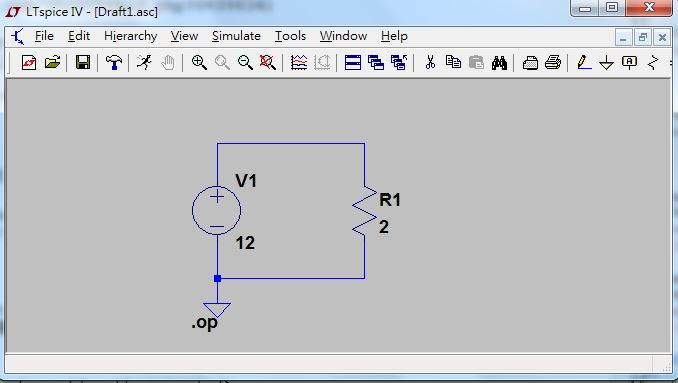

## 看影片學 LTSpice 類比電路設計工具

SPICE 是一種為 IC 積體電路開發的類比電路模擬程式（英語：Simulation Program with Integrated Circuit Emphasis, SPICE），是 1975 年由加州大學伯克萊分校的 Donald Pederson  在電子研究實驗室創建的。

第一版和第二版都是用 Fortran 語言編寫的，但是從第三版開始用 C 語言編寫。從一個稱為 CANCER 的電路模擬程式開始，發展出今日幾乎被全世界公認為電路模擬標準的 SPICE 原始雛型程式。

OrCAD 的 PSpice 是 2000 年之前在個人電腦上最常被大專院校使用的 SPICE 軟體版本。以下是 PSPICE 9.1 student version 這個軟體的下載連結。

* <http://www.electronics-lab.com/downloads/schematic/013/>

但是 OrCAD 在 2000 年被 Cadence Design System 收購之後，似乎就沒有對免費版的 PSpice 進行更新的動作。因此，若想要使用免費的 Spice 軟體，除了使用老舊的 PSPICE 9.1 學生版之外，可能就要改用其他軟體。

雖然開放原始碼有一套 ngspice，但似乎功能並不好用，不是很多人推薦。開放原始碼領域似乎也沒有任何一套 SPICE 軟體被強烈推薦的。

在免費的商用軟體中，TINA 與 LTSpice 是常被提到的兩套 SPICE 軟體，但是似乎 LTSpice 的風評較好，以下是一些相關的討論與文章。

* [Looking to write electrical engineering related open software](http://stackoverflow.com/questions/3581533/looking-to-write-electrical-engineering-related-open-software/3582081#3582081)
* [All About Circuits Forum > Electronics Forums > General Electronics Chat
Reload this Page LTSpice vs. Tina-TI](http://forum.allaboutcircuits.com/showthread.php?t=39834)

由於筆者近來想要找一套 SPICE 的軟體來學習類比電路模擬，於是決定採用在 LTSpice 軟體作為學習工具，因此我上網找了一些的教學影片，以便學習這個軟體。

以下是筆者建議的第一個入門影片：

* [YouTube:Helpful Tools: Intro to LTSPICE](http://youtu.be/AsdwDpgpsj4)

上述影片建立了一個最簡單的電阻電路，如下圖所示：

以上這個電路與示範影片真的很簡單，只要知道 V=IR 這個公式的人應該都可以輕易理解。

接著您可以看看 YouTube 的上傳者 Terry Sturtevant 所給的 10 部 LTSpice 教學影片，
這些影片都很短，每片都只有幾分鐘：

* [YouTube/LTspice/Terry Sturtevant](https://www.youtube.com/playlist?list=PL44572D1F7E26D30D)

這樣，您應該就可以瞭解如可使用 LTSpice 來學習類比電路設計了，接下來就是
將電路學上所學到的電路放到 LTSpice 裏面進行測試，這樣應該就能更深入的體會
各種模型的意義了。

### 參考文獻
* 維基百科：[OrCAD PSpice](http://zh.wikipedia.org/wiki/OrCAD_PSpice)
* 維基百科：[SPICE](http://zh.wikipedia.org/wiki/SPICE)
* Wikipedia:[SPICE](http://en.wikipedia.org/wiki/SPICE)
* Wikipedia:[LTSpice](http://en.wikipedia.org/wiki/LTspice)
* [Interactive LTSpice Tutorial](http://www.simonbramble.co.uk/lt_spice/ltspice_lt_spice.htm)

【本文由陳鍾誠取材並修改自 [維基百科]，採用創作共用的 [姓名標示、相同方式分享] 授權】
